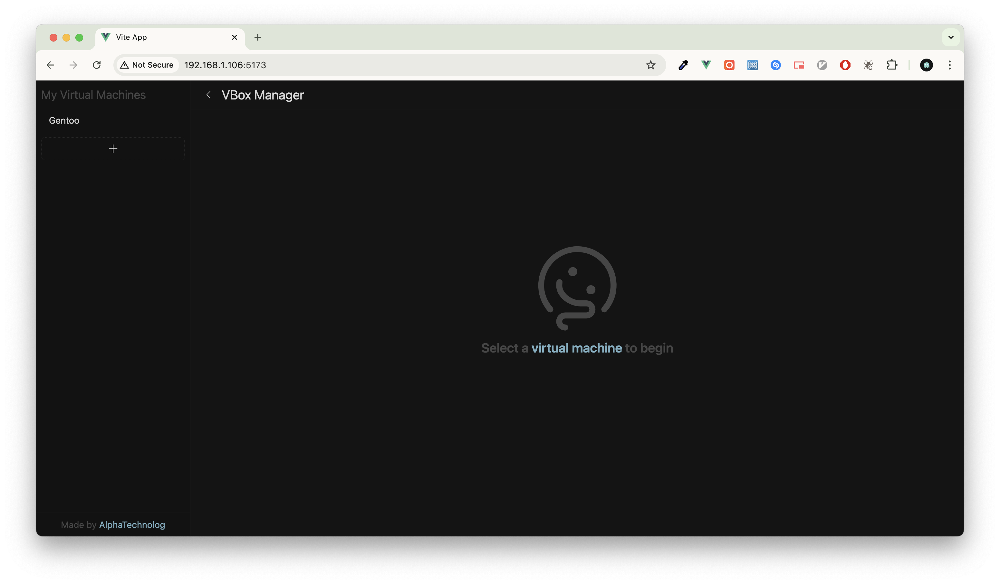
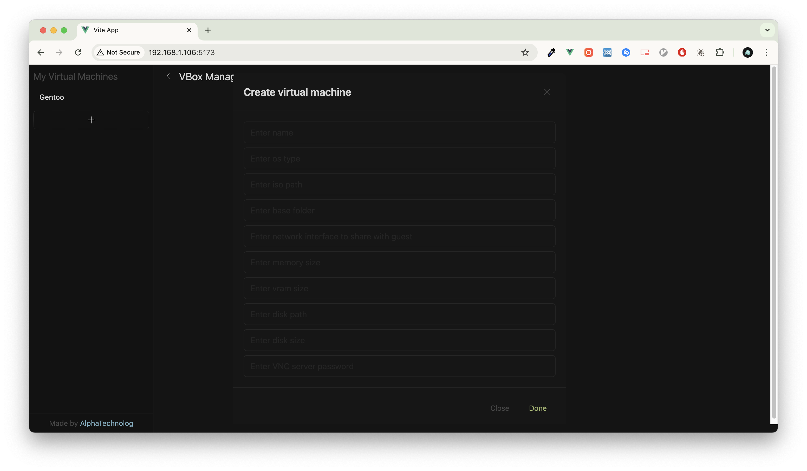
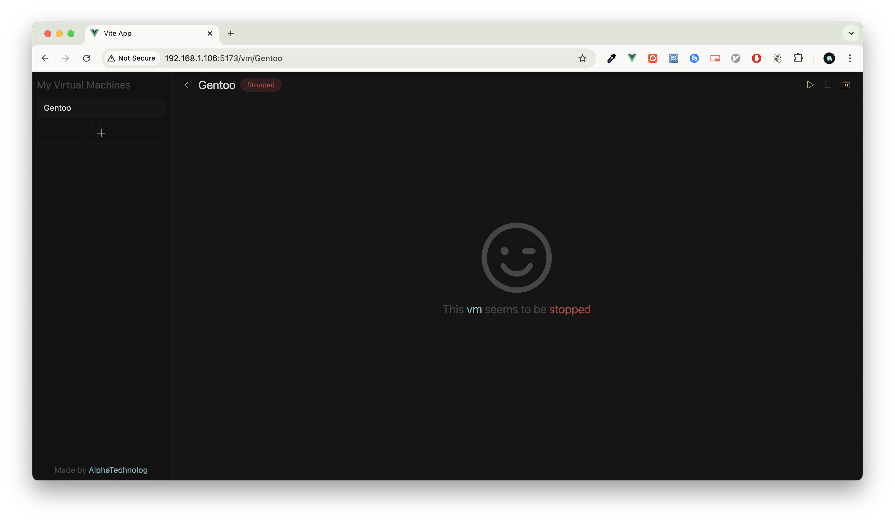
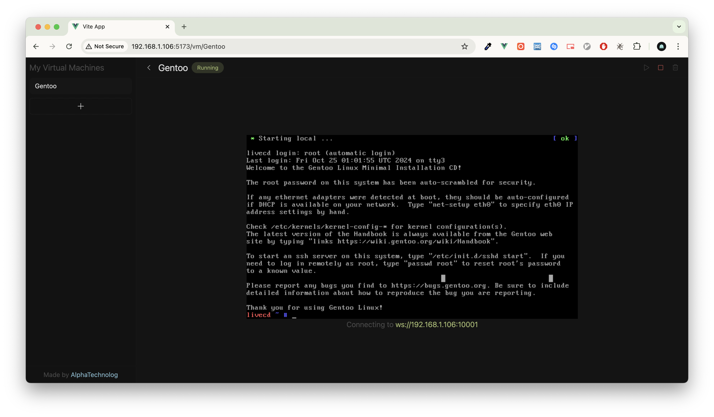

# VBox Manager API

> [!NOTE]
> The backend for this project [here](https://github.com/alphatechnolog/vbox-manager-api), check it out aswell!

This project's purpose is to provide a simple solution for remote virtualbox-based machines management! And this is the api repository. The idea is to let you create/start/stop/remove virtual machines and also allow you to connect through ssh and even connect directly from the frontend itself via vnc! (or via an external vnc guest)

## Getting started

### Manual installation

First install the next dependencies

- nodejs
- npm (you can use [bun](https://bun.sh/) for pkgs management aswell)
- git
- virtualbox
- virtualbox-ext-vnc (on arch linux, on others you might need to manually install this extension or else the vnc viewer will just hang in the web)

Then go ahead and type these commands:

```sh
git clone https://github.com/AlphaTechnolog/vbox-manager-api.git
cd vbox-manager-frontend
npm install
npm run dev
```

This should start a new server process in the port 5173 or whatever vite tells you to open, then open the url in your browser.

### Using [nix](https://nixos.org/download/)

Download git using your system's package manager and then you should be able to do this.

```sh
git clone https://github.com/AlphaTechnolog/vbox-manager-api.git
cd vbox-manager-api
nix develop
```

This will open a shell where you already have got nodejs and npm installed, so you can go ahead and do

```sh
npm install && npm run dev
```

And should be the same, it will open some kind of webserver with the frontend.

## How do i use this?

Go to the app in your web client, and you will be presented with a simple screen like this



> Obviously without a virtual machine in the sidebar

Then you can click in the button to create vm in the sidebar, and you'll be presented with something like this



In there you should fill the form, and in paths fields you should put the absolute path in your server (maybe we could improve this user experience by having a place where you upload isos and then select them).

Example data I used to create that Gentoo VM

- name: Gentoo
- ostype: Gentoo_64 (use `VBoxManage list ostypes` in the host to see the available ones).
- iso path: /mnt/storage/iso/install-amd64-minimal-20240915T163400Z.iso
- base folder: /mnt/storage/distros (this will be the folder where all the vm files gets stored at)
- network interface: eno1 (interface to share across the host and the guest)
- memory size: 8000 (8gb)
- vram size: 128
- disk path: /mnt/storage/distros/Gentoo_DISK.vdi (this is server path)
- vnc password: alpha123. (password im gonna use to connect with vnc)

After the vm gets created, you can navigate through them in the sidebar and then you should see something like this



Then go ahead and start it using the toolbar in the top, there you can remove, stop and start the vm.

After starting the vm, the vnc client will ask you for password, then it will show you the vm screen just in the web, there you should be able to setup ssh so you can use it easily.



## Q/A

### How do i expose it in my lan?

Use `npm run dev -- --host` instead, then you should be able to open in another device an url like `http://<private-host-ip>:<server-port>` and it should be able to connect to the api aswell if it's running there aswell.

### So, how does the frontend where to connect?

It will just use the hostname it already has (either it's localhost or your private ip) + 8080 which is the backend default port.

### How do i build this for production purposes

First of you should have the api project running in the same server you're gonna deploy this frontend on... We could add a way to manually put the backend url, but for now you just would have to modify [this file](./src/api/axios.ts) and in there, put the backend address in the baseURL line. After that you can use

```sh
npm run build
```

And then deploy the dist folder generated by vite in your server, either it's using nginx, apache, or even `python -m http.server 4444` (lmao)